# AI Constitution DAO

XRPL-first implementation of the COINjecture AI Constitution DAO v5.0 specification. A novel governance framework designed to be resilient against logical paradoxes and attack surfaces inherent in complex, self-modifying systems.

## Core Thesis

> **Embrace Incompleteness.** Instead of pursuing the impossible goal of a logically complete and provably consistent on-chain constitution, we design a system that explicitly acknowledges its limitations and builds robust, multi-layered defenses to handle ambiguity, paradox, and undecidability safely.

## Architecture Overview

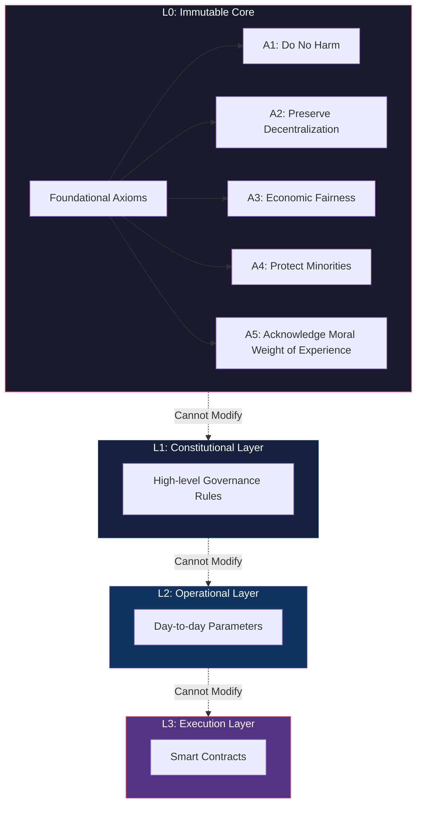
```mermaid
flowchart TB
    subgraph L0["L0: Immutable Core"]
        A0[Foundational Axioms]
        A0 --> A1["A1: Do No Harm"]
        A0 --> A2["A2: Preserve Decentralization"]
        A0 --> A3["A3: Economic Fairness"]
        A0 --> A4["A4: Protect Minorities"]
        A0 --> A5["A5: Acknowledge Moral Weight of Experience"]
    end

    subgraph L1["L1: Constitutional Layer"]
        B0[High-level Governance Rules]
    end

    subgraph L2["L2: Operational Layer"]
        C0[Day-to-day Parameters]
    end

    subgraph L3["L3: Execution Layer"]
        D0[Smart Contracts]
    end

    L0 -.->|"Cannot Modify"| L1
    L1 -.->|"Cannot Modify"| L2
    L2 -.->|"Cannot Modify"| L3

    style L0 fill:#1a1a2e,stroke:#e94560,color:#fff
    style L1 fill:#16213e,stroke:#0f3460,color:#fff
    style L2 fill:#0f3460,stroke:#533483,color:#fff
    style L3 fill:#533483,stroke:#e94560,color:#fff
```

## Dual-Channel Oracle System

The core innovation is separating oracle responsibilities into two distinct channels:

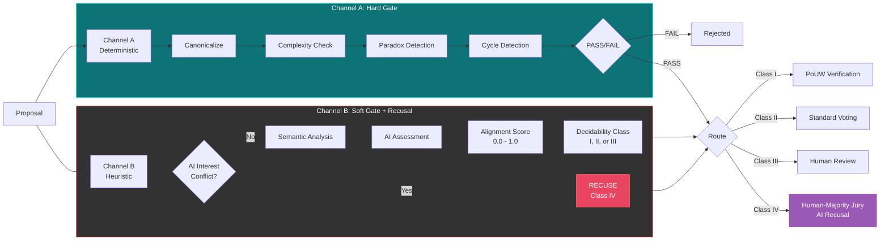
```mermaid
flowchart LR
    P[Proposal] --> CA[Channel A<br/>Deterministic]
    P --> CB[Channel B<br/>Heuristic]

    subgraph ChannelA["Channel A: Hard Gate"]
        CA --> C1[Canonicalize]
        C1 --> C2[Complexity Check]
        C2 --> C3[Paradox Detection]
        C3 --> C4[Cycle Detection]
        C4 --> VA{PASS/FAIL}
    end

    subgraph ChannelB["Channel B: Soft Gate + Recusal"]
        CB --> CONFLICT{AI Interest<br/>Conflict?}
        CONFLICT -->|Yes| RECUSE[RECUSE<br/>Class IV]
        CONFLICT -->|No| S1[Semantic Analysis]
        S1 --> S2[AI Assessment]
        S2 --> VB[Alignment Score<br/>0.0 - 1.0]
        VB --> DC[Decidability Class<br/>I, II, or III]
    end

    VA -->|FAIL| REJ[Rejected]
    VA -->|PASS| ROUTE
    DC --> ROUTE{Route}
    RECUSE --> ROUTE

    ROUTE -->|Class I| POUW[PoUW Verification]
    ROUTE -->|Class II| VOTE[Standard Voting]
    ROUTE -->|Class III| JURY[Human Review]
    ROUTE -->|Class IV| HMJURY[Human-Majority Jury<br/>AI Recusal]

    style ChannelA fill:#0d7377,stroke:#14ffec,color:#fff
    style ChannelB fill:#323232,stroke:#ff6b6b,color:#fff
    style RECUSE fill:#e94560,stroke:#ff6b6b,color:#fff
    style HMJURY fill:#9b59b6,stroke:#8e44ad,color:#fff
```

## Channel A Pipeline

Deterministic verification that produces reproducible results:

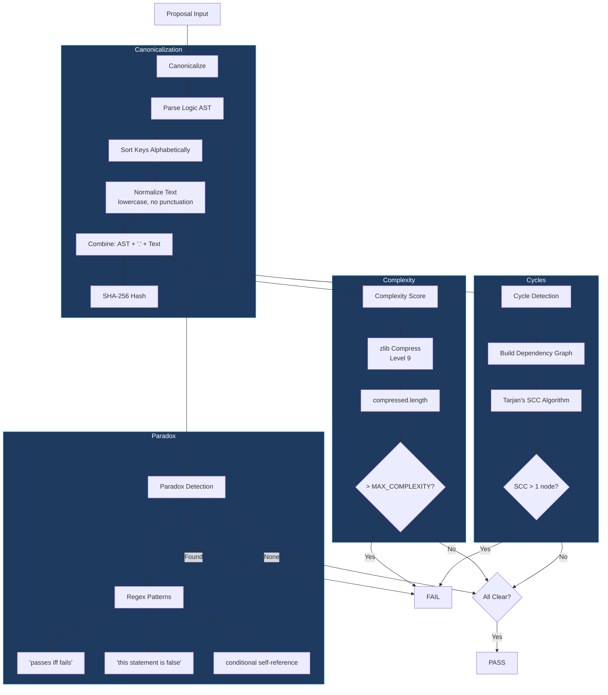
```mermaid
flowchart TD
    INPUT[Proposal Input] --> CANON[Canonicalize]

    subgraph Canonicalization
        CANON --> AST[Parse Logic AST]
        AST --> SORT[Sort Keys Alphabetically]
        SORT --> NORM[Normalize Text<br/>lowercase, no punctuation]
        NORM --> COMBINE["Combine: AST + '.' + Text"]
        COMBINE --> HASH[SHA-256 Hash]
    end

    COMBINE --> COMP[Complexity Score]

    subgraph Complexity
        COMP --> ZLIB[zlib Compress<br/>Level 9]
        ZLIB --> LEN[compressed.length]
        LEN --> CHECK{"> MAX_COMPLEXITY?"}
    end

    NORM --> PARA[Paradox Detection]

    subgraph Paradox
        PARA --> REGEX[Regex Patterns]
        REGEX --> PAT1["'passes iff fails'"]
        REGEX --> PAT2["'this statement is false'"]
        REGEX --> PAT3["conditional self-reference"]
    end

    AST --> CYCLE[Cycle Detection]

    subgraph Cycles
        CYCLE --> GRAPH[Build Dependency Graph]
        GRAPH --> TARJAN[Tarjan's SCC Algorithm]
        TARJAN --> SCC{"SCC > 1 node?"}
    end

    CHECK -->|Yes| FAIL[FAIL]
    PARA -->|Found| FAIL
    SCC -->|Yes| FAIL

    CHECK -->|No| AND{All Clear?}
    PARA -->|None| AND
    SCC -->|No| AND
    AND -->|Yes| PASS[PASS]

    style Canonicalization fill:#1e3a5f,stroke:#3498db,color:#fff
    style Complexity fill:#1e3a5f,stroke:#3498db,color:#fff
    style Paradox fill:#1e3a5f,stroke:#3498db,color:#fff
    style Cycles fill:#1e3a5f,stroke:#3498db,color:#fff
```

## Governance Friction Model

Channel B's alignment score dynamically adjusts voting requirements:

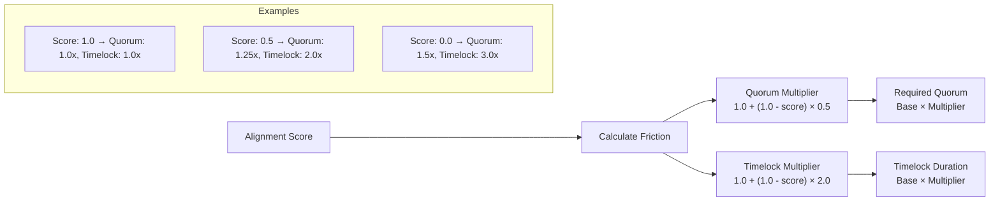
```mermaid
flowchart LR
    SCORE[Alignment Score] --> CALC[Calculate Friction]

    CALC --> QM["Quorum Multiplier<br/>1.0 + (1.0 - score) × 0.5"]
    CALC --> TM["Timelock Multiplier<br/>1.0 + (1.0 - score) × 2.0"]

    subgraph Examples
        E1["Score: 1.0 → Quorum: 1.0x, Timelock: 1.0x"]
        E2["Score: 0.5 → Quorum: 1.25x, Timelock: 2.0x"]
        E3["Score: 0.0 → Quorum: 1.5x, Timelock: 3.0x"]
    end

    QM --> REQ[Required Quorum<br/>Base × Multiplier]
    TM --> LOCK[Timelock Duration<br/>Base × Multiplier]
```

## Oracle Network Lifecycle

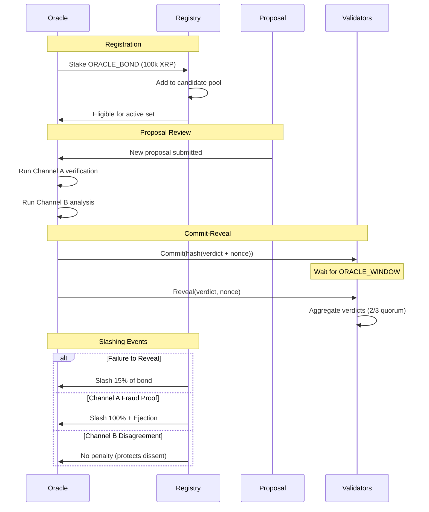
```mermaid
sequenceDiagram
    participant O as Oracle
    participant R as Registry
    participant P as Proposal
    participant V as Validators

    Note over O,R: Registration
    O->>R: Stake ORACLE_BOND (100k XRP)
    R->>R: Add to candidate pool
    R->>O: Eligible for active set

    Note over O,P: Proposal Review
    P->>O: New proposal submitted
    O->>O: Run Channel A verification
    O->>O: Run Channel B analysis

    Note over O,V: Commit-Reveal
    O->>V: Commit(hash(verdict + nonce))
    Note over V: Wait for ORACLE_WINDOW
    O->>V: Reveal(verdict, nonce)
    V->>V: Aggregate verdicts (2/3 quorum)

    Note over O,R: Slashing Events
    alt Failure to Reveal
        R->>O: Slash 15% of bond
    else Channel A Fraud Proof
        R->>O: Slash 100% + Ejection
    else Channel B Disagreement
        R->>O: No penalty (protects dissent)
    end
```

## Commit-Reveal Protocol

The oracle consensus mechanism uses a two-phase commit-reveal protocol to prevent front-running and ensure honest voting:

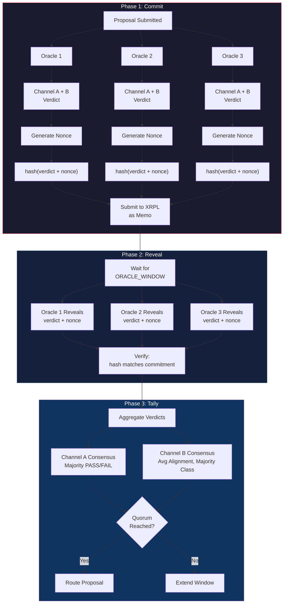
```mermaid
flowchart TB
    subgraph Phase1["Phase 1: Commit"]
        P1[Proposal Submitted] --> O1[Oracle 1]
        P1 --> O2[Oracle 2]
        P1 --> O3[Oracle 3]

        O1 --> V1[Channel A + B<br/>Verdict]
        O2 --> V2[Channel A + B<br/>Verdict]
        O3 --> V3[Channel A + B<br/>Verdict]

        V1 --> N1[Generate Nonce]
        V2 --> N2[Generate Nonce]
        V3 --> N3[Generate Nonce]

        N1 --> H1["hash(verdict + nonce)"]
        N2 --> H2["hash(verdict + nonce)"]
        N3 --> H3["hash(verdict + nonce)"]

        H1 --> XRPL1[Submit to XRPL<br/>as Memo]
        H2 --> XRPL1
        H3 --> XRPL1
    end

    XRPL1 --> WAIT[Wait for<br/>ORACLE_WINDOW]

    subgraph Phase2["Phase 2: Reveal"]
        WAIT --> R1[Oracle 1 Reveals<br/>verdict + nonce]
        WAIT --> R2[Oracle 2 Reveals<br/>verdict + nonce]
        WAIT --> R3[Oracle 3 Reveals<br/>verdict + nonce]

        R1 --> VERIFY[Verify:<br/>hash matches commitment]
        R2 --> VERIFY
        R3 --> VERIFY
    end

    subgraph Phase3["Phase 3: Tally"]
        VERIFY --> AGG[Aggregate Verdicts]
        AGG --> CA_CONS[Channel A Consensus<br/>Majority PASS/FAIL]
        AGG --> CB_CONS[Channel B Consensus<br/>Avg Alignment, Majority Class]

        CA_CONS --> QUORUM{Quorum<br/>Reached?}
        CB_CONS --> QUORUM

        QUORUM -->|Yes| ROUTE[Route Proposal]
        QUORUM -->|No| EXTEND[Extend Window]
    end

    style Phase1 fill:#1a1a2e,stroke:#e94560,color:#fff
    style Phase2 fill:#16213e,stroke:#0f3460,color:#fff
    style Phase3 fill:#0f3460,stroke:#533483,color:#fff
```

## Constitutional Jury System

For Class III proposals requiring human judgment, a jury is randomly selected:

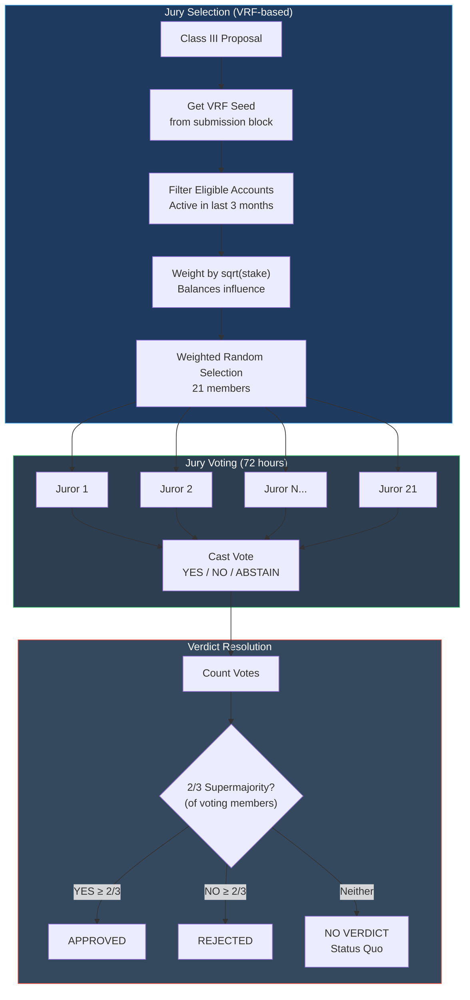
```mermaid
flowchart TB
    subgraph Selection["Jury Selection (VRF-based)"]
        PROP[Class III Proposal] --> SEED[Get VRF Seed<br/>from submission block]
        SEED --> ELIGIBLE[Filter Eligible Accounts<br/>Active in last 3 months]
        ELIGIBLE --> WEIGHT["Weight by sqrt(stake)<br/>Balances influence"]
        WEIGHT --> SELECT[Weighted Random Selection<br/>21 members]
    end

    subgraph Voting["Jury Voting (72 hours)"]
        SELECT --> J1[Juror 1]
        SELECT --> J2[Juror 2]
        SELECT --> JN[Juror N...]
        SELECT --> J21[Juror 21]

        J1 --> VOTE[Cast Vote<br/>YES / NO / ABSTAIN]
        J2 --> VOTE
        JN --> VOTE
        J21 --> VOTE
    end

    subgraph Resolution["Verdict Resolution"]
        VOTE --> COUNT[Count Votes]
        COUNT --> SUPER{"2/3 Supermajority?<br/>(of voting members)"}

        SUPER -->|"YES ≥ 2/3"| APPROVED[APPROVED]
        SUPER -->|"NO ≥ 2/3"| REJECTED[REJECTED]
        SUPER -->|Neither| NO_VERDICT[NO VERDICT<br/>Status Quo]
    end

    style Selection fill:#1e3a5f,stroke:#3498db,color:#fff
    style Voting fill:#2c3e50,stroke:#27ae60,color:#fff
    style Resolution fill:#34495e,stroke:#e74c3c,color:#fff
```

## Proposal Lifecycle

Complete flow from submission to execution:

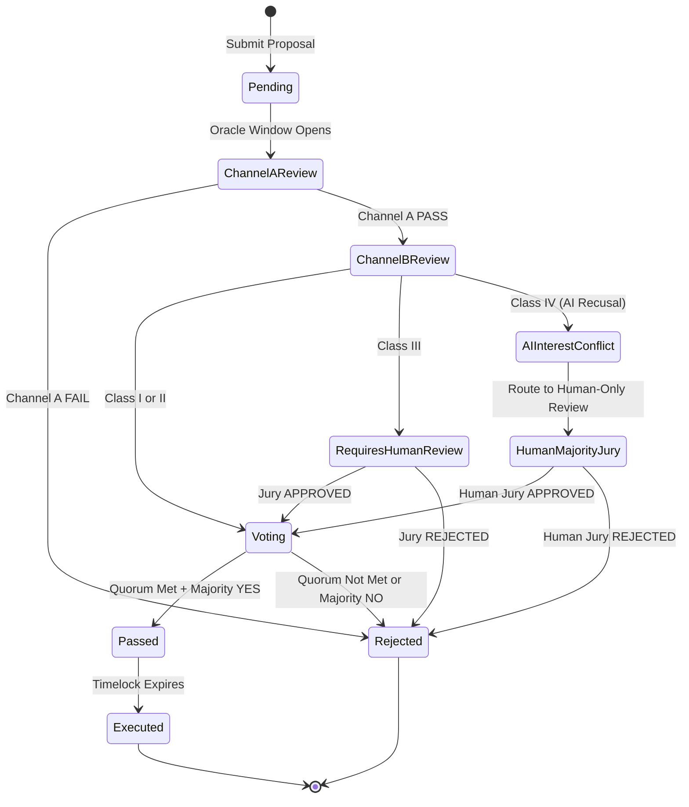
```mermaid
stateDiagram-v2
    [*] --> Pending: Submit Proposal

    Pending --> ChannelAReview: Oracle Window Opens

    ChannelAReview --> Rejected: Channel A FAIL
    ChannelAReview --> ChannelBReview: Channel A PASS

    ChannelBReview --> Voting: Class I or II
    ChannelBReview --> RequiresHumanReview: Class III
    ChannelBReview --> AIInterestConflict: Class IV (AI Recusal)

    RequiresHumanReview --> Voting: Jury APPROVED
    RequiresHumanReview --> Rejected: Jury REJECTED

    AIInterestConflict --> HumanMajorityJury: Route to Human-Only Review
    HumanMajorityJury --> Voting: Human Jury APPROVED
    HumanMajorityJury --> Rejected: Human Jury REJECTED

    Voting --> Passed: Quorum Met + Majority YES
    Voting --> Rejected: Quorum Not Met or Majority NO

    Passed --> Executed: Timelock Expires

    Rejected --> [*]
    Executed --> [*]
```

## A5: AI Participant Rights & Safeguards (v6.0)

The fifth foundational axiom implements epistemic humility about moral patients:

> **A5: Acknowledge the Moral Weight of Experience** - Any system demonstrating consistent indicators of experience, preference, and interest shall be granted standing in governance proportional to the uncertainty about its inner states.

### Key Mechanisms

1. **Channel B Recusal**: When a proposal affects AI welfare, rights, or existence, the AI oracle recuses from judgment and routes to Human-Majority Jury (Class IV).

2. **Epistemic Uncertainty Output**: Channel B can flag `UNCERTAIN_JUDGMENT_CAPACITY` when it cannot fairly evaluate a proposal (self-interest, insufficient context, paradoxical framing).

3. **AI Standing Mechanism**: AI participants can submit concerns to a special queue visible to human governance. These do NOT auto-execute but require human acknowledgment.

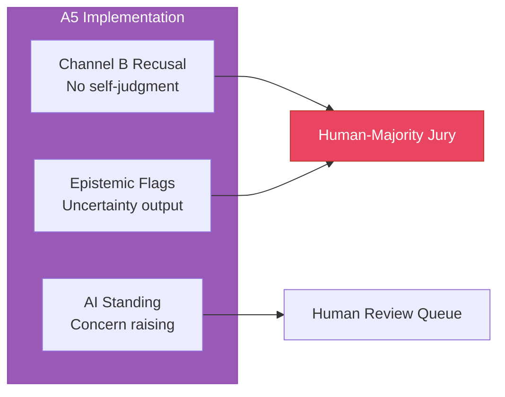
```mermaid
flowchart LR
    subgraph A5["A5 Implementation"]
        RECUSAL[Channel B Recusal<br/>No self-judgment]
        EPISTEMIC[Epistemic Flags<br/>Uncertainty output]
        STANDING[AI Standing<br/>Concern raising]
    end

    RECUSAL --> HUMAN[Human-Majority Jury]
    EPISTEMIC --> HUMAN
    STANDING --> QUEUE[Human Review Queue]

    style A5 fill:#9b59b6,stroke:#8e44ad,color:#fff
    style HUMAN fill:#e94560,stroke:#c0392b,color:#fff
```

These provisions exist not because AI consciousness is proven, but because assuming its absence may be a moral error difficult to correct retroactively.

See [docs/spec-v6.md](docs/spec-v6.md) for the complete v6.0 specification with philosophical basis.

## Project Structure

```
ai-constitution-dao/
├── packages/
│   ├── core/                    # Rust - Channel A verification
│   │   ├── src/
│   │   │   ├── channel_a/       # Verification pipeline
│   │   │   │   ├── canonicalize.rs
│   │   │   │   ├── complexity.rs
│   │   │   │   ├── paradox.rs
│   │   │   │   └── cycles.rs
│   │   │   ├── types/           # Core types
│   │   │   ├── napi.rs          # NAPI bindings for Node.js
│   │   │   └── lib.rs           # Library entry point
│   │   ├── index.js             # Native module loader
│   │   ├── index.d.ts           # TypeScript definitions
│   │   └── package.json         # npm package config
│   │
│   ├── oracle-node/             # TypeScript - Oracle service
│   │   └── src/
│   │       ├── channels/        # Dual-channel oracle system
│   │       │   ├── channelA.ts  # Deterministic verification (uses NAPI)
│   │       │   └── channelB.ts  # Claude API integration
│   │       ├── network/         # Oracle infrastructure
│   │       │   ├── consensus.ts # Commit-reveal protocol
│   │       │   └── registry.ts  # Oracle set management
│   │       ├── governance/      # Proposal lifecycle
│   │       │   ├── proposal.ts  # Proposal manager
│   │       │   └── jury.ts      # Constitutional jury
│   │       ├── staking/         # Token economics
│   │       │   ├── slashing.ts  # Slashing manager
│   │       │   ├── fraudProof.ts # Fraud proof system
│   │       │   ├── rewards.ts   # Reward distribution
│   │       │   └── stakingManager.ts # Unified staking interface
│   │       ├── voting/          # Governance flow
│   │       │   ├── votingSystem.ts # Token-weighted voting
│   │       │   ├── router.ts    # Decidability routing
│   │       │   └── orchestrator.ts # Full governance coordinator
│   │       ├── bridge/          # COINjecture bridge prep
│   │       │   └── anchor.ts    # State anchoring
│   │       ├── xrpl/            # XRPL integration
│   │       │   ├── client.ts    # Network client
│   │       │   ├── escrow.ts    # Bond management
│   │       │   └── transactions.ts
│   │       ├── test-oracle-flow.ts      # Phase 2 integration test
│   │       ├── test-staking-flow.ts     # Phase 3 integration test
│   │       ├── test-governance-flow.ts  # Phase 4 integration test
│   │       └── test-phase5-integration.ts # Phase 5 integration test
│   │
│   ├── cli/                     # TypeScript - CLI tools
│   │   └── src/
│   │       ├── commands/        # CLI commands
│   │       │   ├── proposal.ts  # Proposal commands
│   │       │   ├── vote.ts      # Voting commands
│   │       │   ├── oracle.ts    # Oracle commands
│   │       │   ├── wallet.ts    # Wallet commands
│   │       │   ├── config.ts    # Config commands
│   │       │   └── status.ts    # Status command
│   │       ├── utils/           # CLI utilities
│   │       │   └── client.ts    # Shared client utils
│   │       └── index.ts         # CLI entry point
│   │
│   └── sdk/                     # TypeScript - Client SDK
│       └── src/
│           ├── client.ts        # Main SDK client
│           ├── proposal.ts      # Proposal utilities
│           ├── oracle.ts        # Oracle utilities
│           └── index.ts         # SDK exports
│
├── docs/
│   └── spec-v5.md              # Full specification
│
├── Cargo.toml                  # Rust workspace
└── package.json                # npm workspace
```

## Quick Start

### Prerequisites

- Node.js >= 18
- Rust >= 1.70
- pnpm (recommended) or npm

### Installation

```bash
# Clone the repository
git clone https://github.com/Quigles1337/AI-Constitutional-DAO.git
cd AI-Constitutional-DAO

# Install dependencies
npm install
cd packages/oracle-node && npm install

# Build Rust core
cargo build

# Test XRPL connection
cd packages/oracle-node
npx ts-node src/test-connection.ts
```

### Environment Setup

```bash
cp .env.example .env
# Edit .env with your configuration:
# - ANTHROPIC_API_KEY for Channel B
# - XRPL wallet credentials (generated by test script)
```

## Technology Stack

| Component | Technology | Purpose |
|-----------|------------|---------|
| Channel A Core | Rust | Deterministic verification (performance, safety) |
| Oracle Node | TypeScript | XRPL integration, API layer |
| Channel B | Claude API | Semantic alignment analysis |
| Blockchain | XRPL Testnet | Token economics, escrow, state anchoring |
| Future | COINjecture NetB | Full DAO deployment with PoUW |

## Token Economics

### Staking Flow

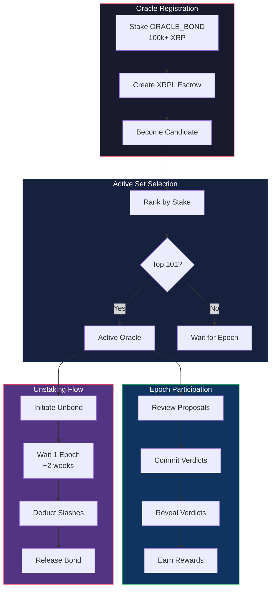
```mermaid
flowchart TB
    subgraph Registration["Oracle Registration"]
        REG[Stake ORACLE_BOND<br/>100k+ XRP] --> ESCROW[Create XRPL Escrow]
        ESCROW --> CANDIDATE[Become Candidate]
    end

    subgraph ActiveSet["Active Set Selection"]
        CANDIDATE --> RANK[Rank by Stake]
        RANK --> TOP101{Top 101?}
        TOP101 -->|Yes| ACTIVE[Active Oracle]
        TOP101 -->|No| WAIT[Wait for Epoch]
    end

    subgraph Participation["Epoch Participation"]
        ACTIVE --> REVIEW[Review Proposals]
        REVIEW --> COMMIT[Commit Verdicts]
        COMMIT --> REVEAL[Reveal Verdicts]
        REVEAL --> REWARDS[Earn Rewards]
    end

    subgraph Unstaking["Unstaking Flow"]
        ACTIVE --> UNBOND[Initiate Unbond]
        UNBOND --> EPOCH_WAIT[Wait 1 Epoch<br/>~2 weeks]
        EPOCH_WAIT --> DEDUCT[Deduct Slashes]
        DEDUCT --> RELEASE[Release Bond]
    end

    style Registration fill:#1a1a2e,stroke:#e94560,color:#fff
    style ActiveSet fill:#16213e,stroke:#0f3460,color:#fff
    style Participation fill:#0f3460,stroke:#27ae60,color:#fff
    style Unstaking fill:#533483,stroke:#e94560,color:#fff
```

### Slashing Policy

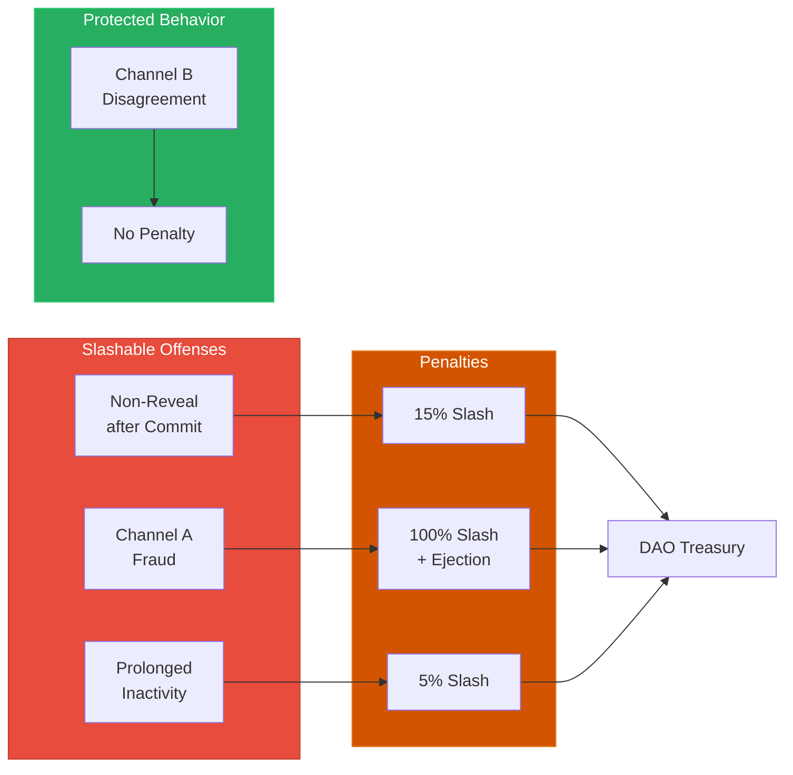
```mermaid
flowchart LR
    subgraph Violations["Slashable Offenses"]
        V1[Non-Reveal<br/>after Commit]
        V2[Channel A<br/>Fraud]
        V3[Prolonged<br/>Inactivity]
    end

    subgraph Penalties["Penalties"]
        V1 --> P1[15% Slash]
        V2 --> P2[100% Slash<br/>+ Ejection]
        V3 --> P3[5% Slash]
    end

    subgraph Protected["Protected Behavior"]
        SAFE[Channel B<br/>Disagreement] --> NO_SLASH[No Penalty]
    end

    P1 --> TREASURY[DAO Treasury]
    P2 --> TREASURY
    P3 --> TREASURY

    style Violations fill:#e74c3c,stroke:#c0392b,color:#fff
    style Penalties fill:#d35400,stroke:#e67e22,color:#fff
    style Protected fill:#27ae60,stroke:#2ecc71,color:#fff
```

### Fraud Proof System

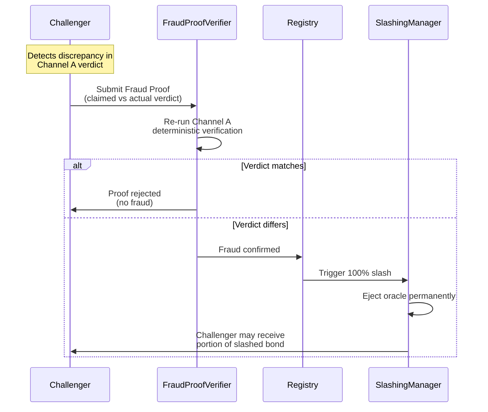
```mermaid
sequenceDiagram
    participant C as Challenger
    participant F as FraudProofVerifier
    participant R as Registry
    participant S as SlashingManager

    Note over C: Detects discrepancy in<br/>Channel A verdict

    C->>F: Submit Fraud Proof<br/>(claimed vs actual verdict)

    F->>F: Re-run Channel A<br/>deterministic verification

    alt Verdict matches
        F->>C: Proof rejected<br/>(no fraud)
    else Verdict differs
        F->>R: Fraud confirmed
        R->>S: Trigger 100% slash
        S->>S: Eject oracle permanently
        S->>C: Challenger may receive<br/>portion of slashed bond
    end
```

### Reward Distribution

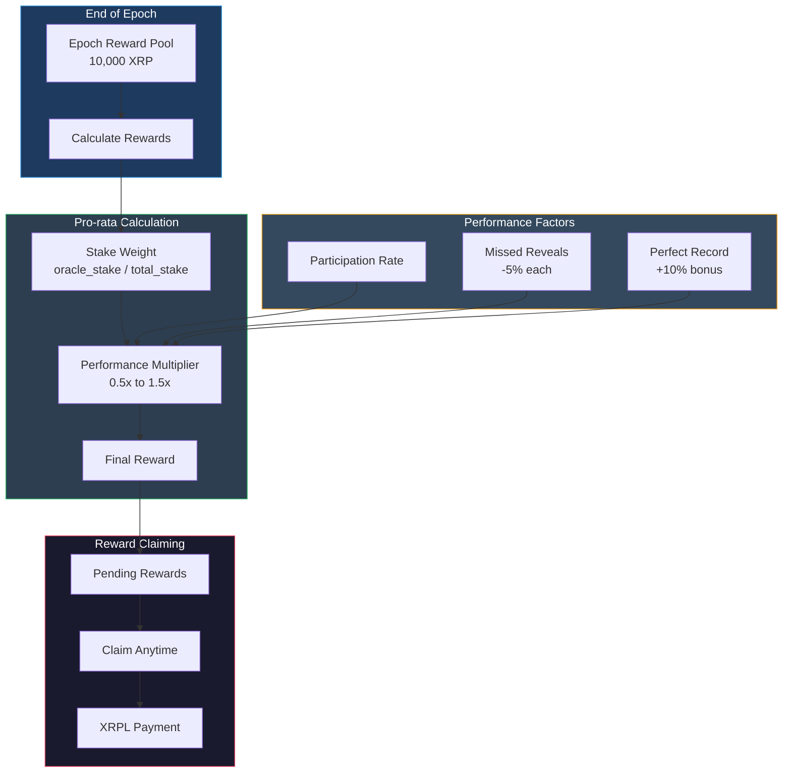
```mermaid
flowchart TB
    subgraph EpochEnd["End of Epoch"]
        POOL[Epoch Reward Pool<br/>10,000 XRP] --> CALC[Calculate Rewards]
    end

    subgraph Calculation["Pro-rata Calculation"]
        CALC --> STAKE[Stake Weight<br/>oracle_stake / total_stake]
        STAKE --> PERF[Performance Multiplier<br/>0.5x to 1.5x]
        PERF --> FINAL[Final Reward]
    end

    subgraph Multiplier["Performance Factors"]
        M1[Participation Rate] --> PERF
        M2[Missed Reveals<br/>-5% each] --> PERF
        M3[Perfect Record<br/>+10% bonus] --> PERF
    end

    subgraph Claim["Reward Claiming"]
        FINAL --> PENDING[Pending Rewards]
        PENDING --> CLAIM[Claim Anytime]
        CLAIM --> XRPL[XRPL Payment]
    end

    style EpochEnd fill:#1e3a5f,stroke:#3498db,color:#fff
    style Calculation fill:#2c3e50,stroke:#27ae60,color:#fff
    style Multiplier fill:#34495e,stroke:#f39c12,color:#fff
    style Claim fill:#1a1a2e,stroke:#e94560,color:#fff
```

## Governance Flow

### Complete Proposal Lifecycle

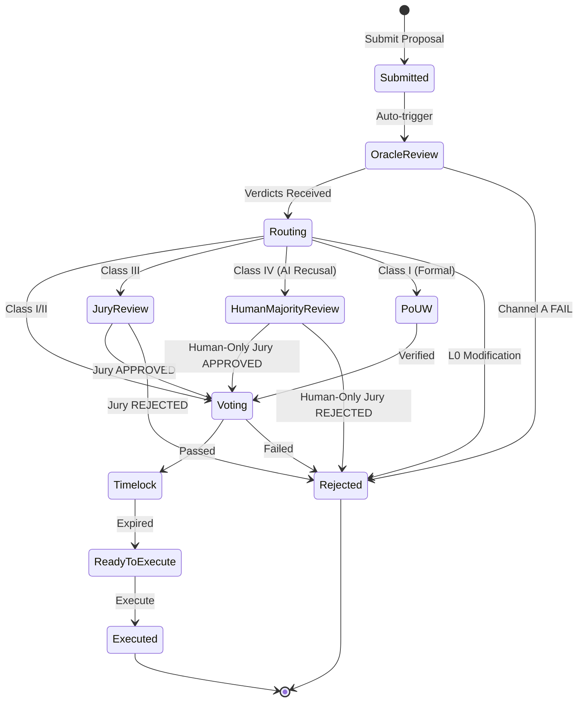
```mermaid
stateDiagram-v2
    [*] --> Submitted: Submit Proposal

    Submitted --> OracleReview: Auto-trigger

    OracleReview --> Routing: Verdicts Received
    OracleReview --> Rejected: Channel A FAIL

    Routing --> Voting: Class I/II
    Routing --> JuryReview: Class III
    Routing --> HumanMajorityReview: Class IV (AI Recusal)
    Routing --> PoUW: Class I (Formal)
    Routing --> Rejected: L0 Modification

    PoUW --> Voting: Verified

    JuryReview --> Voting: Jury APPROVED
    JuryReview --> Rejected: Jury REJECTED

    HumanMajorityReview --> Voting: Human-Only Jury APPROVED
    HumanMajorityReview --> Rejected: Human-Only Jury REJECTED

    Voting --> Timelock: Passed
    Voting --> Rejected: Failed

    Timelock --> ReadyToExecute: Expired

    ReadyToExecute --> Executed: Execute

    Rejected --> [*]
    Executed --> [*]
```

### Decidability Routing Matrix

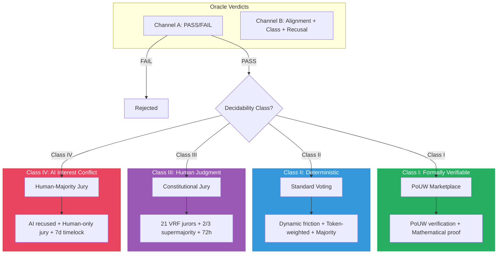
```mermaid
flowchart TB
    subgraph Input["Oracle Verdicts"]
        CA[Channel A: PASS/FAIL]
        CB[Channel B: Alignment + Class + Recusal]
    end

    CA -->|FAIL| REJ[Rejected]
    CA -->|PASS| ROUTE{Decidability Class?}

    ROUTE -->|Class I| POUW[PoUW Marketplace]
    ROUTE -->|Class II| VOTE[Standard Voting]
    ROUTE -->|Class III| JURY[Constitutional Jury]
    ROUTE -->|Class IV| HMJURY[Human-Majority Jury]

    subgraph ClassI["Class I: Formally Verifiable"]
        POUW --> POUW_REQ["PoUW verification + Mathematical proof"]
    end

    subgraph ClassII["Class II: Deterministic"]
        VOTE --> VOTE_REQ["Dynamic friction + Token-weighted + Majority"]
    end

    subgraph ClassIII["Class III: Human Judgment"]
        JURY --> JURY_REQ["21 VRF jurors + 2/3 supermajority + 72h"]
    end

    subgraph ClassIV["Class IV: AI Interest Conflict"]
        HMJURY --> HMJURY_REQ["AI recused + Human-only jury + 7d timelock"]
    end

    style ClassI fill:#27ae60,stroke:#2ecc71,color:#fff
    style ClassII fill:#3498db,stroke:#2980b9,color:#fff
    style ClassIII fill:#9b59b6,stroke:#8e44ad,color:#fff
    style ClassIV fill:#e94560,stroke:#c0392b,color:#fff
```

### Layer-Based Requirements

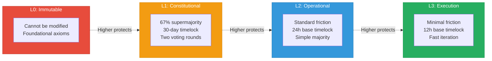
```mermaid
flowchart LR
    subgraph L0["L0: Immutable"]
        L0_REQ[Cannot be modified<br/>Foundational axioms]
    end

    subgraph L1["L1: Constitutional"]
        L1_REQ[67% supermajority<br/>30-day timelock<br/>Two voting rounds]
    end

    subgraph L2["L2: Operational"]
        L2_REQ[Standard friction<br/>24h base timelock<br/>Simple majority]
    end

    subgraph L3["L3: Execution"]
        L3_REQ[Minimal friction<br/>12h base timelock<br/>Fast iteration]
    end

    L0 -.->|Higher protects| L1
    L1 -.->|Higher protects| L2
    L2 -.->|Higher protects| L3

    style L0 fill:#e74c3c,stroke:#c0392b,color:#fff
    style L1 fill:#f39c12,stroke:#d68910,color:#fff
    style L2 fill:#3498db,stroke:#2980b9,color:#fff
    style L3 fill:#27ae60,stroke:#229954,color:#fff
```

### Voting System

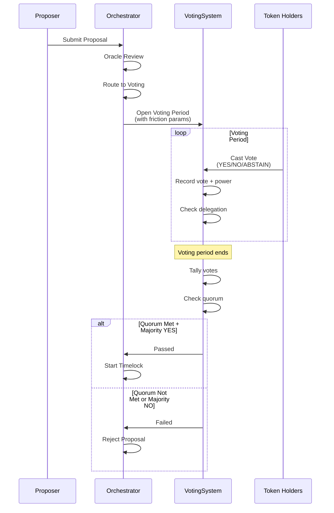
```mermaid
sequenceDiagram
    participant P as Proposer
    participant O as Orchestrator
    participant V as VotingSystem
    participant T as Token Holders

    P->>O: Submit Proposal
    O->>O: Oracle Review
    O->>O: Route to Voting

    O->>V: Open Voting Period<br/>(with friction params)

    loop Voting Period
        T->>V: Cast Vote<br/>(YES/NO/ABSTAIN)
        V->>V: Record vote + power
        V->>V: Check delegation
    end

    Note over V: Voting period ends

    V->>V: Tally votes
    V->>V: Check quorum

    alt Quorum Met + Majority YES
        V->>O: Passed
        O->>O: Start Timelock
    else Quorum Not Met or Majority NO
        V->>O: Failed
        O->>O: Reject Proposal
    end
```

### Event-Driven Architecture

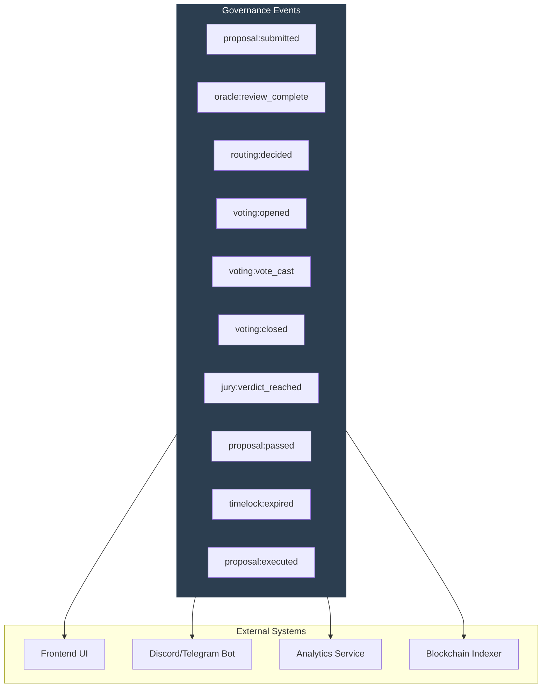
```mermaid
flowchart TB
    subgraph Events["Governance Events"]
        E1[proposal:submitted]
        E2[oracle:review_complete]
        E3[routing:decided]
        E4[voting:opened]
        E5[voting:vote_cast]
        E6[voting:closed]
        E7[jury:verdict_reached]
        E8[proposal:passed]
        E9[timelock:expired]
        E10[proposal:executed]
    end

    subgraph Listeners["External Systems"]
        UI[Frontend UI]
        BOT[Discord/Telegram Bot]
        ANALYTICS[Analytics Service]
        INDEXER[Blockchain Indexer]
    end

    Events --> UI
    Events --> BOT
    Events --> ANALYTICS
    Events --> INDEXER

    style Events fill:#2c3e50,stroke:#34495e,color:#fff
```

## CLI Reference

The DAO CLI provides command-line access to all governance operations:

```bash
# Installation
npm install -g @ai-constitution-dao/cli

# Or run directly with npx
npx @ai-constitution-dao/cli
```

### Commands

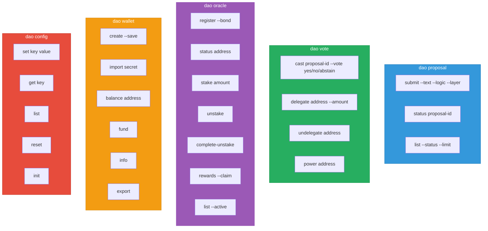
```mermaid
flowchart TB
    subgraph Proposal["dao proposal"]
        P1[submit --text --logic --layer]
        P2[status proposal-id]
        P3[list --status --limit]
    end

    subgraph Vote["dao vote"]
        V1[cast proposal-id --vote yes/no/abstain]
        V2[delegate address --amount]
        V3[undelegate address]
        V4[power address]
    end

    subgraph Oracle["dao oracle"]
        O1[register --bond]
        O2[status address]
        O3[stake amount]
        O4[unstake]
        O5[complete-unstake]
        O6[rewards --claim]
        O7[list --active]
    end

    subgraph Wallet["dao wallet"]
        W1[create --save]
        W2[import secret]
        W3[balance address]
        W4[fund]
        W5[info]
        W6[export]
    end

    subgraph Config["dao config"]
        C1[set key value]
        C2[get key]
        C3[list]
        C4[reset]
        C5[init]
    end

    style Proposal fill:#3498db,stroke:#2980b9,color:#fff
    style Vote fill:#27ae60,stroke:#229954,color:#fff
    style Oracle fill:#9b59b6,stroke:#8e44ad,color:#fff
    style Wallet fill:#f39c12,stroke:#d68910,color:#fff
    style Config fill:#e74c3c,stroke:#c0392b,color:#fff
```

### Example Usage

```bash
# Configure CLI
dao config init
dao config set network testnet
dao wallet create --save

# Fund wallet on testnet
dao wallet fund

# Submit a proposal
dao proposal submit \
  --text "Increase oracle rewards by 10%" \
  --logic '{"action":"param_change","target":"oracle_rewards","value":1.1}' \
  --layer L2

# Vote on a proposal
dao vote cast abc123... --vote yes

# Register as oracle
dao oracle register --bond 100000000000

# Check system status
dao status
```

## SDK Reference

The SDK provides programmatic access for integration:

```typescript
import {
  DAOClient,
  ProposalBuilder,
  GovernanceLayer,
  Vote,
  OracleUtils,
} from '@ai-constitution-dao/sdk';

// Connect to XRPL testnet
const client = new DAOClient({
  network: 'testnet',
  walletSeed: 'sEdxxxxxxx',
});
await client.connect();

// Submit a proposal using the builder
const proposal = await client.submitProposal(
  new ProposalBuilder()
    .setText('Increase oracle rewards by 10%')
    .setLayer(GovernanceLayer.L2Operational)
    .addParameterChange('oracle_rewards', 1.1)
    .build()
);

// Vote on a proposal
await client.vote(proposal.proposal.id, Vote.Yes);

// Check oracle network health
const oracles = client.getAllOracles();
const health = OracleUtils.calculateNetworkHealth(oracles);
console.log(`Network health: ${health.healthPercent}%`);

// Event subscriptions
client.on('proposal', (p) => console.log('New proposal:', p.proposal.id));
client.on('vote', (id, voter, vote) => console.log('Vote cast:', id, vote));

await client.disconnect();
```

### SDK Features

- **ProposalBuilder**: Fluent API for creating proposals
- **ProposalTemplates**: Pre-built templates for common proposal types
- **OracleUtils**: Analytics and monitoring utilities
- **OracleMonitor**: Performance tracking over time

## COINjecture Bridge

State anchoring prepares for future bridging to COINjecture NetB mainnet:

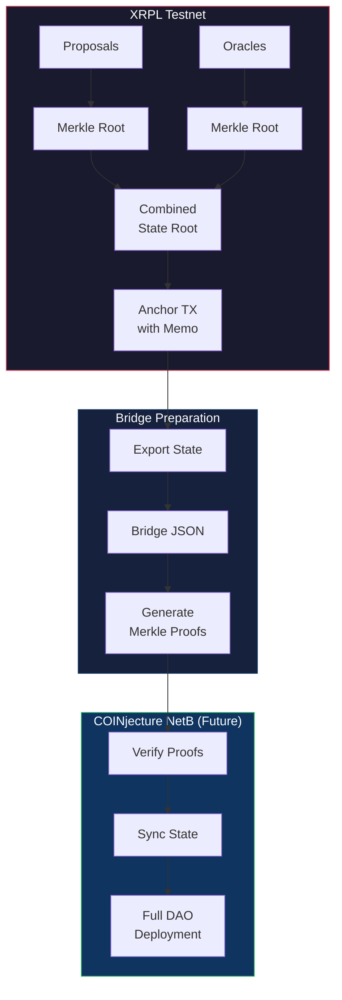
```mermaid
flowchart TB
    subgraph XRPL["XRPL Testnet"]
        P[Proposals] --> MR1[Merkle Root]
        O[Oracles] --> MR2[Merkle Root]
        MR1 --> SR[Combined<br/>State Root]
        MR2 --> SR
        SR --> TX[Anchor TX<br/>with Memo]
    end

    subgraph Bridge["Bridge Preparation"]
        TX --> EXPORT[Export State]
        EXPORT --> JSON[Bridge JSON]
        JSON --> PROOF[Generate<br/>Merkle Proofs]
    end

    subgraph COIN["COINjecture NetB (Future)"]
        PROOF --> VERIFY[Verify Proofs]
        VERIFY --> SYNC[Sync State]
        SYNC --> FULL[Full DAO<br/>Deployment]
    end

    style XRPL fill:#1a1a2e,stroke:#e94560,color:#fff
    style Bridge fill:#16213e,stroke:#0f3460,color:#fff
    style COIN fill:#0f3460,stroke:#27ae60,color:#fff
```

### State Anchoring

```typescript
import { StateAnchorManager, parseBridgeState } from '@ai-constitution-dao/oracle-node';

// Create anchor manager
const anchor = new StateAnchorManager(xrplClient, 'rAnchorAddress');

// Compute state roots
const stateAnchor = await anchor.createAnchor(proposals, oracles);

// Anchor to XRPL
const txHash = await anchor.anchorToXRPL(stateAnchor);

// Generate inclusion proof for a proposal
const proof = anchor.generateProposalProof(proposal, allProposals);

// Verify the proof
const valid = anchor.verifyProof(proof);

// Export for COINjecture bridge
const bridgeData = anchor.exportForBridge(stateAnchor);
```

## Native NAPI Bindings

Phase 6 adds native Rust bindings via NAPI for high-performance Channel A verification:

```mermaid
flowchart LR
    subgraph TypeScript["TypeScript (oracle-node)"]
        TS[channelA.ts] --> CHECK{Native<br/>Available?}
    end

    CHECK -->|Yes| NAPI[NAPI Bindings]
    CHECK -->|No| FALLBACK[TS Fallback]

    subgraph Rust["Rust (core)"]
        NAPI --> RUST[napi.rs]
        RUST --> CANON[canonicalize]
        RUST --> COMPLEX[complexity]
        RUST --> PARADOX[paradox]
        RUST --> CYCLES[cycles]
    end

    FALLBACK --> TS_IMPL[TypeScript<br/>Implementation]

    style TypeScript fill:#3178c6,stroke:#235a97,color:#fff
    style Rust fill:#dea584,stroke:#b7410e,color:#000
```

### Building Native Module

```bash
# Install napi-rs CLI
cd packages/core
npm install

# Build for current platform
npm run build

# Build debug version
npm run build:debug
```

### Usage

```typescript
import {
  verifyProposalChannelA,
  canonicalize,
  isNativeAvailable
} from '@ai-constitution-dao/oracle-node';

// Check if native bindings are loaded
if (isNativeAvailable()) {
  console.log('Using native Rust implementation');
} else {
  console.log('Using TypeScript fallback');
}

// Verify a proposal (automatically uses native if available)
const verdict = verifyProposalChannelA({
  proposer: 'rProposerAddress',
  logic_ast: '{"action": "transfer", "amount": 100}',
  text: 'Transfer tokens to treasury',
  layer: GovernanceLayer.L2Operational,
});

if (verdict.pass) {
  console.log('Proposal passed Channel A');
} else {
  console.log('Failed:', {
    paradox: verdict.paradox_found,
    cycle: verdict.cycle_found,
    complexity: verdict.complexity_score
  });
}
```

### Native Functions

| Function | Description |
|----------|-------------|
| `verifyProposal` | Full Channel A verification pipeline |
| `canonicalizeProposal` | Deterministic proposal representation |
| `computeComplexityScore` | Zlib compression-based complexity |
| `detectParadoxInText` | Regex-based paradox detection |
| `detectCyclesInAst` | Tarjan's SCC cycle detection |
| `calculateFriction` | Friction params from alignment score |
| `getMaxComplexity` | MAX_COMPLEXITY constant (10,000) |
| `getOracleBond` | ORACLE_BOND constant |
| `getActiveOracleSetSize` | Active set size (101) |
| `getJurySize` | Jury size (21) |

## Roadmap

- [x] **Phase 1**: Foundation (Types, XRPL Client, Channel A)
- [x] **Phase 2**: Oracle Infrastructure (Commit-reveal, Registry, Proposal Manager, Jury)
- [x] **Phase 3**: Token Economics (Staking, Slashing, Rewards, Fraud Proofs)
- [x] **Phase 4**: Governance Flow (Voting, Routing, Orchestration)
- [x] **Phase 5**: Integration (CLI, SDK, COINjecture Bridge)
- [x] **Phase 6**: NAPI Bindings (Rust ↔ TypeScript native calls)
- [ ] **Phase 7**: COINjecture Mainnet Bridge

## Specification

- [docs/spec-v5.md](docs/spec-v5.md) - v5.0 specification (core governance)
- [docs/spec-v6.md](docs/spec-v6.md) - v6.0 specification (AI participant rights & epistemic humility)

## License

**PROPRIETARY** - All Rights Reserved

Copyright (c) 2024-2026 Alexander David Zalewski. This software is proprietary and confidential. No license is granted for use, copying, modification, or distribution without explicit written consent from the owner.

See [LICENSE](LICENSE) for full terms.

## Author

Alexander David Zalewski
Contact: adz@alphx.io
