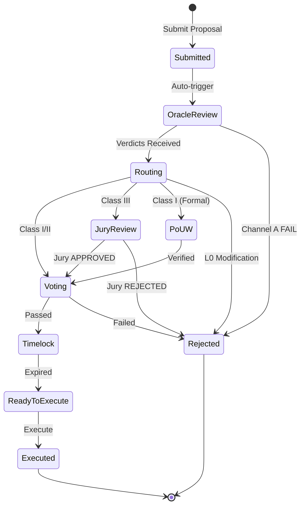

# AI Constitution DAO

XRPL-first implementation of the COINjecture AI Constitution DAO v5.0 specification. A novel governance framework designed to be resilient against logical paradoxes and attack surfaces inherent in complex, self-modifying systems.

## Core Thesis

> **Embrace Incompleteness.** Instead of pursuing the impossible goal of a logically complete and provably consistent on-chain constitution, we design a system that explicitly acknowledges its limitations and builds robust, multi-layered defenses to handle ambiguity, paradox, and undecidability safely.

## Architecture Overview


## Dual-Channel Oracle System

The core innovation is separating oracle responsibilities into two distinct channels:


## Channel A Pipeline

Deterministic verification that produces reproducible results:


## Governance Friction Model

Channel B's alignment score dynamically adjusts voting requirements:


## Oracle Network Lifecycle


## Commit-Reveal Protocol

The oracle consensus mechanism uses a two-phase commit-reveal protocol to prevent front-running and ensure honest voting:


## Constitutional Jury System

For Class III proposals requiring human judgment, a jury is randomly selected:


## Proposal Lifecycle

Complete flow from submission to execution:


## Project Structure

```
ai-constitution-dao/
├── packages/
│   ├── core/                    # Rust - Channel A verification
│   │   └── src/
│   │       ├── channel_a/       # Verification pipeline
│   │       │   ├── canonicalize.rs
│   │       │   ├── complexity.rs
│   │       │   ├── paradox.rs
│   │       │   └── cycles.rs
│   │       └── types/           # Core types
│   │
│   └── oracle-node/             # TypeScript - Oracle service
│       └── src/
│           ├── channels/        # Channel B implementation
│           │   └── channelB.ts  # Claude API integration
│           ├── network/         # Oracle infrastructure
│           │   ├── consensus.ts # Commit-reveal protocol
│           │   └── registry.ts  # Oracle set management
│           ├── governance/      # Proposal lifecycle
│           │   ├── proposal.ts  # Proposal manager
│           │   └── jury.ts      # Constitutional jury
│           ├── staking/         # Token economics
│           │   ├── slashing.ts  # Slashing manager
│           │   ├── fraudProof.ts # Fraud proof system
│           │   ├── rewards.ts   # Reward distribution
│           │   └── stakingManager.ts # Unified staking interface
│           ├── voting/          # Governance flow
│           │   ├── votingSystem.ts # Token-weighted voting
│           │   ├── router.ts    # Decidability routing
│           │   └── orchestrator.ts # Full governance coordinator
│           ├── xrpl/            # XRPL integration
│           │   ├── client.ts    # Network client
│           │   ├── escrow.ts    # Bond management
│           │   └── transactions.ts
│           ├── test-oracle-flow.ts     # Phase 2 integration test
│           ├── test-staking-flow.ts    # Phase 3 integration test
│           └── test-governance-flow.ts # Phase 4 integration test
│
├── docs/
│   └── spec-v5.md              # Full specification
│
├── Cargo.toml                  # Rust workspace
└── package.json                # npm workspace
```

## Quick Start

### Prerequisites

- Node.js >= 18
- Rust >= 1.70
- pnpm (recommended) or npm

### Installation

```bash
# Clone the repository
git clone https://github.com/Quigles1337/AI-Constitutional-DAO.git
cd AI-Constitutional-DAO

# Install dependencies
npm install
cd packages/oracle-node && npm install

# Build Rust core
cargo build

# Test XRPL connection
cd packages/oracle-node
npx ts-node src/test-connection.ts
```

### Environment Setup

```bash
cp .env.example .env
# Edit .env with your configuration:
# - ANTHROPIC_API_KEY for Channel B
# - XRPL wallet credentials (generated by test script)
```

## Technology Stack

| Component | Technology | Purpose |
|-----------|------------|---------|
| Channel A Core | Rust | Deterministic verification (performance, safety) |
| Oracle Node | TypeScript | XRPL integration, API layer |
| Channel B | Claude API | Semantic alignment analysis |
| Blockchain | XRPL Testnet | Token economics, escrow, state anchoring |
| Future | COINjecture NetB | Full DAO deployment with PoUW |

## Token Economics

### Staking Flow


### Slashing Policy


### Fraud Proof System


### Reward Distribution


## Governance Flow

### Complete Proposal Lifecycle



### Decidability Routing Matrix

```mermaid
flowchart TB
    subgraph Input["Oracle Verdicts"]
        CA[Channel A<br/>PASS/FAIL]
        CB[Channel B<br/>Alignment + Class]
    end

    CA -->|FAIL| REJ[Rejected]
    CA -->|PASS| ROUTE{Decidability<br/>Class?}

    ROUTE -->|Class I| POUW[PoUW Marketplace]
    ROUTE -->|Class II| VOTE[Standard Voting]
    ROUTE -->|Class III| JURY[Constitutional Jury]

    subgraph ClassI["Class I: Formally Verifiable"]
        POUW --> POUW_REQ[Requirements:<br/>• PoUW verification<br/>• Mathematical proof]
    end

    subgraph ClassII["Class II: Deterministic"]
        VOTE --> VOTE_REQ[Requirements:<br/>• Dynamic friction<br/>• Token-weighted votes<br/>• Simple majority]
    end

    subgraph ClassIII["Class III: Human Judgment"]
        JURY --> JURY_REQ[Requirements:<br/>• 21 jurors (VRF selected)<br/>• 2/3 supermajority<br/>• 72-hour period]
    end

    style ClassI fill:#27ae60,stroke:#2ecc71,color:#fff
    style ClassII fill:#3498db,stroke:#2980b9,color:#fff
    style ClassIII fill:#9b59b6,stroke:#8e44ad,color:#fff
```

### Layer-Based Requirements


### Voting System


### Event-Driven Architecture


## Roadmap

- [x] **Phase 1**: Foundation (Types, XRPL Client, Channel A)
- [x] **Phase 2**: Oracle Infrastructure (Commit-reveal, Registry, Proposal Manager, Jury)
- [x] **Phase 3**: Token Economics (Staking, Slashing, Rewards, Fraud Proofs)
- [x] **Phase 4**: Governance Flow (Voting, Routing, Orchestration)
- [ ] **Phase 5**: Integration (CLI, SDK, COINjecture Bridge)

## Specification

See [docs/spec-v5.md](docs/spec-v5.md) for the complete v5.0 specification.

## License

MIT

## Author

Alexander David Zalewski
